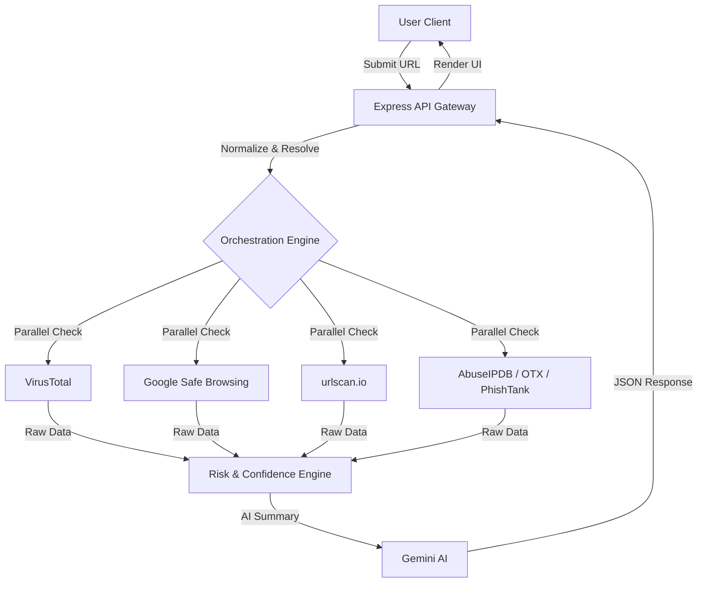

# 🔐 SafeNet AI – Intelligent Cybersecurity Intelligence Platform

[](https://nodejs.org/)
[](https://reactjs.org/)
[](https://vercel.com/)
[](https://opensource.org/licenses/MIT)

**SafeNet AI** is a professional-grade cybersecurity web application designed to empower users with real-time multi-source threat intelligence. From suspicious URL analysis to data breach monitoring, SafeNet AI translates complex security telemetry into actionable insights.

---

## 🚀 Overview

SafeNet AI has evolved from a simple scanner into a **Multi-Source Threat Intelligence Hub**. By aggregating data from 6+ industry-leading security providers, it provides a comprehensive 360-degree view of any URL's reputation and potential risk.

---

## ✨ Key Features

### 🌐 Multi-Source URL Scanner
- **Parallel Intelligence**: Simultaneously queries VirusTotal, Google Safe Browsing, urlscan.io, PhishTank, AbuseIPDB, and OTX AlienVault.
- **Weighted Risk Scoring**: Heuristic calculation (0-100) based on source reliability and detection counts.
- **Micro-Verdicts**: Deep breakdown of detections vs. clean results for every provider.
- **Dynamic Confidence**: Real-time confidence percentage based on provider responsiveness.
- **Behavioral Analysis**: Live web page renderings and behavioral analysis via urlscan.io.

### 📧 Breach & Identity Intelligence
- **Data Leak Check**: Scans historical breaches via LeakCheck API to identify exposed credentials.
- **Exposure Mapping**: Detailed reports on which services leaked your data and when.

### 🤖 AI-Powered Analysis
- **Contextual Summary**: Gemini AI-driven explanations that translate raw scores into plain-English security advice.
- **Historical Reporting**: Full MongoDB-backed history of all scans with professional export options (PDF, CSV, JSON).

---

## 🏗 System Architecture

The platform follows a robust orchestration flow to ensure maximum accuracy and fault tolerance:



---

## 🛡️ Integrated Providers

| Provider | Purpose | Reliability |
| :--- | :--- | :--- |
| **VirusTotal** | Global Reputation Aggregator (70+ engines) | ⭐️ High |
| **Google Safe Browsing** | Malware & Social Engineering Detection | ⭐️ High |
| **urlscan.io** | Behavioral Analysis & Visual Scanning | ⭐️ Medium |
| **PhishTank** | Community-Verified Phishing Intelligence | ⭐️ Medium |
| **AbuseIPDB** | IP Reputation & Reporting | ⭐️ Medium |
| **OTX AlienVault** | Threat Indicator Enrichment | ⭐️ Medium |

*Note: The system is fault-tolerant; even if some providers are unreachable, it will return a verdict with a calculated confidence score.*

---

## 💻 Tech Stack

- **Frontend**: React.js, Tailwind CSS, Framer Motion (for animations).
- **Backend**: Node.js, Express.js.
- **Database**: MongoDB Atlas (Scan history & User management).
- **APIs**: 10+ Integrated Security & AI endpoints.

---

## ⚙️ Setup & Installation

### 1. Prerequisites
- Node.js (v18+)
- MongoDB Atlas account
- API keys for integrated providers

### 2. Installation
```bash
# Clone
git clone https://github.com/RushiBhosale153/CyberNet-AI.git
cd CyberNet-AI

# Install Backend
cd backend && npm install

# Install Frontend
cd ../frontend && npm install
```

### 3. Environment Configuration
Create a `.env` file in the `backend/` folder:
```env
PORT=5000
MONGODB_URI=your_mongodb_uri
JWT_SECRET=your_jwt_secret

VT_API_KEY=your_key
GOOGLE_SAFE_BROWSING_API_KEY=your_key
URLSCAN_API_KEY=your_key
ABUSEIPDB_API_KEY=your_key
OTX_API_KEY=your_key
PHISHTANK_API_KEY=your_key
LEAKCHECK_API_KEY=your_key
GEMINI_API_KEY=your_key
```

### 4. Running the App
```bash
# Backend
npm run dev

# Frontend
npm start
```

---

## 📂 Project Structure

```text
CyberNet-AI/
├── frontend/               # React application
│   ├── src/
│   │   ├── components/     # UI components
│   │   ├── pages/          # Full page views
│   │   └── services/       # API integration (Vercel-ready)
├── backend/                # Express application
│   ├── routes/             # API endpoints
│   ├── services/           # Individual threat intelligence modules
│   ├── utils/              # Scoring & normalization logic
│   └── server.js           # Entry point
└── assets/                 # Brand assets & screenshots
```

---

## 📸 Screenshots

> [!NOTE]
> Screenshots will be populated after the first production deployment. 

1. **Main Dashboard**: High-level overview of latest threats and user activity.
2. **Website Scanner**: Live view of multi-source intelligence breakdown (VirusTotal, GSB, urlscan).
3. **Risk Gauge**: Visual representation of calculated risk scores for scanned URLs.
4. **Exported Reports**: Preview of professional PDF and CSV security reports.

---

## 📜 License
Distributed under the MIT License. See `LICENSE` for more information.

---
*Empowering individuals through intelligence.* 🌐
