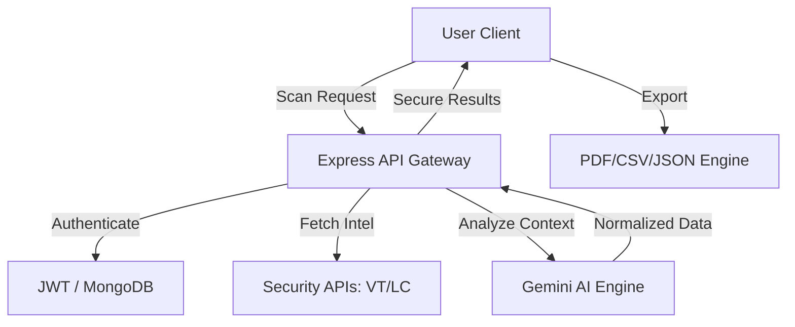

# 🔐 SafeNet AI – Cybersecurity Threat Detection Platform

[](https://nodejs.org/)
[](https://reactjs.org/)
[]()
[]()
[](https://opensource.org/licenses/MIT)

> **SafeNet AI** is an intelligent, AI-powered cybersecurity platform designed to detect phishing attempts, malicious websites, and compromised credentials in real-time. It transforms complex security telemetry into actionable intelligence for everyday users.

---

## 🎯 Project Overview

In an era of sophisticated social engineering, **SafeNet AI** provides a first line of defense. By leveraging industry-leading threat intelligence APIs (VirusTotal, LeakCheck) and advanced AI (Gemini AI), the platform provides users with a comprehensive security assessment of their digital interactions.

### 🔴 The Problem
Cyber threats like phishing are becoming increasingly difficult to spot. Most security tools are either too technical for average users or hidden behind expensive enterprise paywalls, leaving individuals vulnerable to data theft and account takeovers.

### 🟢 The Solution
SafeNet AI bridge this gap by providing a sleek, **cyber-security dashboard** that accepts messages, files, and URLs. It doesn't just say "Safe" or "Unsafe"—it explains *why* using AI-assisted analysis and provides clear protocol recommendations.

---

## ✨ Key Features

### 🕵️ Phishing Analysis
- **Text Extraction**: Scans messages for social engineering patterns and suspicious links.
- **File Scanning**: Upload screenshots or documents to detect embedded phishing attempts.
- **Risk Scoring**: Real-time risk assessment utilizing a 0-100 heuristic engine.

### 🌐 Website Malware Scanner
- **URL Inspection**: Deep inspection of URLs against 70+ security engines via VirusTotal.
- **Neutral Node Analysis**: Breakdown of malicious vs. suspicious vs. clean findings.
- **Domain Reputation**: Verifies site integrity and connection safety.

### 📧 Breach Intelligence
- **Credential Check**: Scans historical data breaches via LeakCheck API.
- **Exposure Mapping**: Identifies exactly which platforms leaked your information.
- **Recovery Advice**: Automated AI recommendations on how to secure compromised accounts.

### 📊 Engagement Log & Reporting
- **Interactive Dashboard**: Expandable, accordion-style history of all security scans.
- **Unified Reporting**: A single source of truth ensures UI and exports are always in sync.
- **Professional Exports**: Generate and download detailed **PDF**, **CSV**, and **JSON** security reports.

---

## 💻 Tech Stack

| Layer | Technology |
| :--- | :--- |
| **Frontend** | React.js, Tailwind CSS, Framer Motion, Lucide/React Icons |
| **Backend** | Node.js, Express.js, JWT, Bcrypt |
| **Database** | MongoDB Atlas |
| **Integrations** | VirusTotal API, LeakCheck API, Gemini AI API, Resend (Email) |

---

## 🏗 System Architecture



---

## ⚙️ Installation & Setup

### 1. Prerequisites
- Node.js (v18+)
- MongoDB Atlas Account
- API Keys: VirusTotal, LeakCheck, Gemini AI

### 2. Clone and Install
```bash
git clone https://github.com/RushiBhosale153/CyberNet-AI.git
cd CyberNet-AI

# Install Backend
cd backend
npm install

# Install Frontend
cd ../frontend
npm install
```

### 3. Environment Variables
Create a `.env` file in the `backend/` directory based on `.env.example`:

```env
# Server
PORT=5000
MONGODB_URI=your_mongo_uri
JWT_SECRET=your_jwt_secret

# Threat Intel
VIRUSTOTAL_API_KEY=your_key
LEAKCHECK_API_KEY=your_key

# AI & Email
GEMINI_API_KEY=your_key
EMAIL_SERVICE_KEY=your_key
```

### 4. Running the App
```bash
# Start Backend (from backend directory)
npm run dev

# Start Frontend (from frontend directory)
npm start
```

---

## 🚀 Future Roadmap

- [ ] **Browser Extension**: Real-time URL scanning while browsing.
- [ ] **Real-time SOC Feed**: A live feed of global cybersecurity threats.
- [ ] **Deep Link Analysis**: Following redirects to find original malicious sources.
- [ ] **Telegram/Discord Bot**: Integrated threat checking for chat apps.

---

## 🔐 Security & Privacy
SafeNet AI focuses on metadata analysis. We do not store the content of your messages or URLs beyond the transient scan period. All credentials are encrypted using industry-standard salted hashing (Bcrypt).

---

## 📜 License
Distributed under the MIT License. See `LICENSE` for more information.

---
*Created for the pursuit of a safer internet.* 🌐
