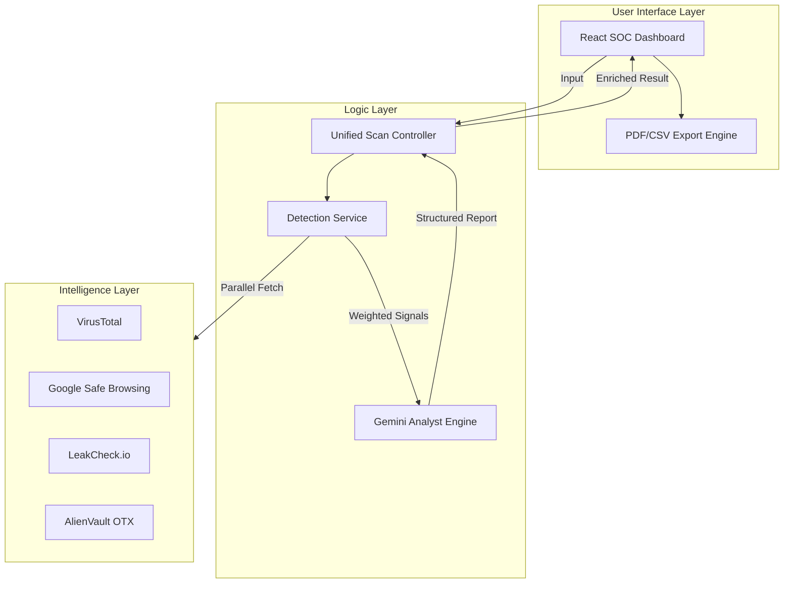

# 🦾 CyberNet AI: Technical Architecture & Flow

This document provides a deep dive into the engineering principles and data orchestration that power the CyberNet AI platform.

---

## 🏗️ System Architecture

CyberNet AI is built on a **Modular Intelligence Architecture**, decoupling threat ingestion from analysis and presentation.

---

## 🛰️ Data Processing Flow

### 1. Ingestion & Normalization
Upon receiving a URL or text input, the system performs sanitization (e.g., removing tracking parameters from URLs) and identifies the target type (URL, Email, or Raw Text).

### 2. Parallel Intelligence Gathering
The `DetectionService` handles parallel execution of multiple threat intelligence APIs using `Promise.allSettled`. This ensures that a single slow or failing API does not block the entire scan.

### 3. Weighted Risk Scoring ($0-100$)
Signals are processed through a weighting algorithm:
- **Major Engines (VT, GSB)**: Up to 40% weight each.
- **Support Engines (OTX, AbuseIPDB)**: Up to 15% weight each.
- **Heuristics (Phishing Detector)**: Scans for urgency, suspicious TLDs, and encoding anomalies.

### 4. Generative AI Synthesis
The raw technical signals are converted into a comprehensive prompt for **Gemini 1.5 Flash**. The AI acts as a **Senior Security Analyst**, summarizing the "Why" behind a risk score and providing actionable protocol recommendations.

---

## 🚦 Security Controls

- **JWT Sanitization**: All requests are validated via middleware before touching scanning logic.
- **Rate Resiliency**: The backend handles API rate limits gracefully, providing "degraded mode" feedback instead of crashing.
- **Privacy First**: Sensitive scan targets are processed in-memory and only metadata (risk level, type) is persisted for the Engagement Log.

---
*CyberNet AI – Precision Intelligence, Automated.*
